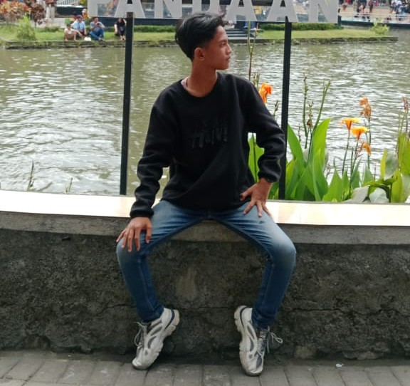

<h1 align="center" style="color:#00e4fd"> 🖥️☪️ RelSanz Proggramer </h1>

<h1 align="center"> 🛠️ Web Developer | Robotics | Network Enthusiast | Konfigurasi Internet | Open Source Contributor</h1> 

🔧 **Skill Utama:**  
`Frontend Development` `Networking` `System Configuration`  

🌱 **Sedang Dipelajari:** React, Node.js, Cybersecurity  
💬 **Tanya saya tentang:** HTML/CSS, JavaScript, atau jaringan komputer  
⚡ **Fun Fact:** Saya suka otak-atik router & bikin script otomatisasi!  

---

## 🧰 **Tech Stack**  
### **Bahasa Pemrograman**  


### **Framework & Tools**  


### **Networking**  


---


|  |  |
|----------------------------------------------------------------------------------------------------------|-----------------------------------------------------------------------------------------------------------------------------------------|
|  |  |


---

## 🌐 **My Projects**  
🔹 **[Web BK](https://github.com/RelSanz-OWN/bk-project)** - Website bk dengan dashboard guru
🔹 **[Aplikasi Bank](https://github.com/RelSanz-OWN/cpp-projek-sederhana)** - Aplikasi Bank dengan fitur saldo

---

## 💬 **Let's Collab!**  
📷 [Instagram](https://instagram.com/yourusername) - **Daily tech stories**  
🎥 [YouTube](https://youtube.com/@yourusername) - **Steaming**  
🎵 [TikTok](https://tiktok.com/@yourusername) - **Coding short**  
🎮 [Discord](https://discord.gg/your-invite-code) - **Dev community**  
💻 [GitHub](https://github.com/yourusername) - **Open-source work**  

---

## 🔥 **Fitur Keren**  
```js

function networkCheck() {
  console.log("Ping google.com...");
}
